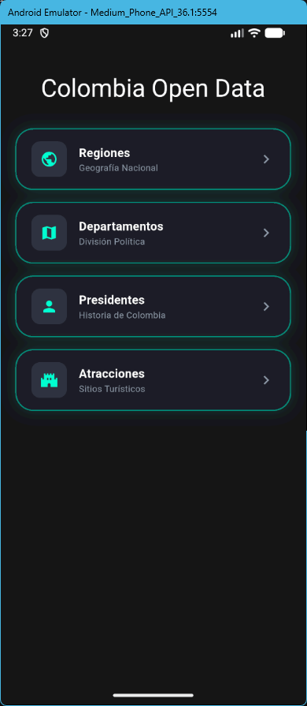
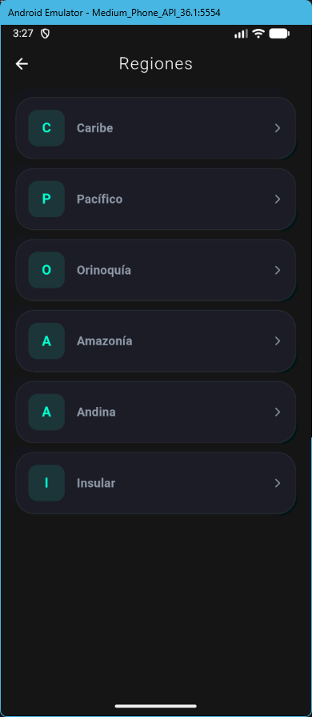
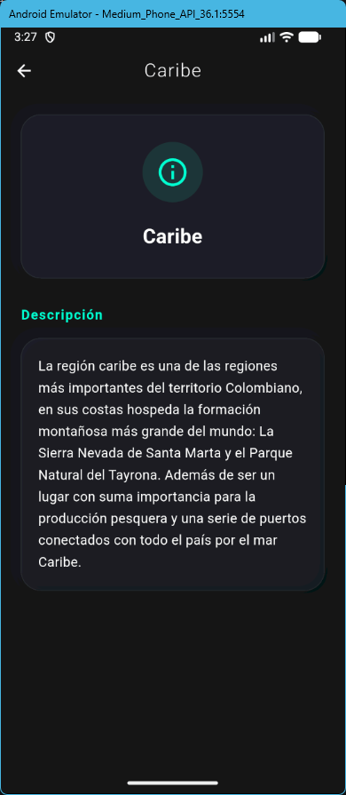
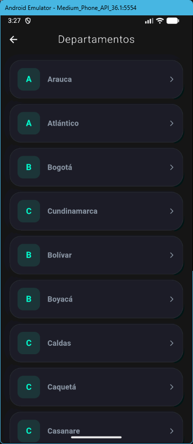
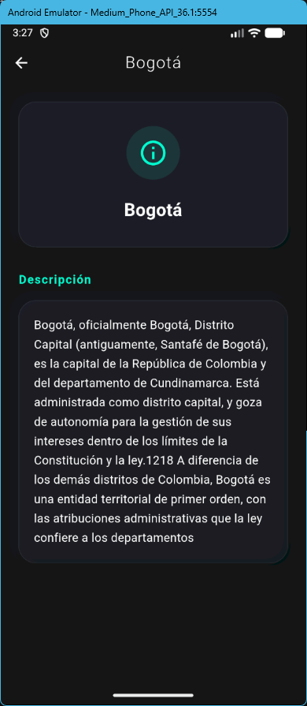
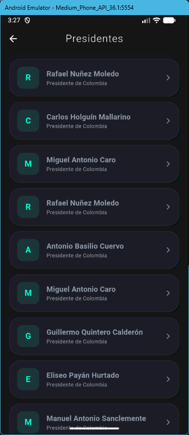
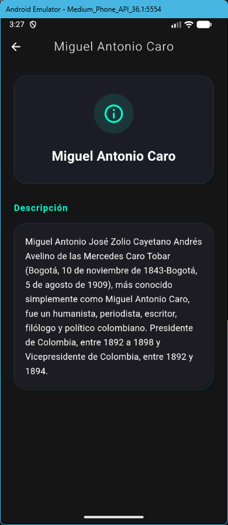
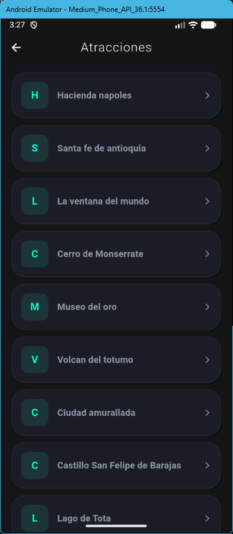
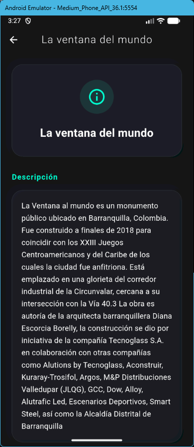

# Taller Datos Abiertos Colombia 🇨🇴

Este proyecto es una aplicación móvil desarrollada en **Flutter** que consume la API pública de Colombia para mostrar información relevante sobre regiones, departamentos, presidentes y atracciones turísticas. La aplicación destaca por un diseño **Premium Neon** con efectos de resplandor y una arquitectura limpia.

## 🚀 Descripción de la API
Se utiliza la **API Colombia**, una fuente de datos abiertos que proporciona información estructurada sobre el país.
- **URL Base**: `https://api-colombia.com/api/v1`
- **Endpoints Utilizados**:
  - `/Region`: Listado de regiones geográficas.
  - `/Department`: División política por departamentos.
  - `/President`: Listado histórico de presidentes.
  - `/TouristicAttraction`: Sitios de interés turístico.

## 🏗️ Arquitectura y Estructura
El proyecto ha sido optimizado para ofrecer una interfaz moderna y unificada:
- **`lib/models/`**: Clases para el mapeo de JSON (Region, Department, President, Attraction).
- **`lib/services/`**: Lógica de consumo de API descentralizada.
- **`lib/views/`**: 
  - `DashboardView`: Pantalla principal con un diseño de **tarjetas horizontales unificadas** con efecto neón.
  - `DataListView`: Listado dinámico con tarjetas estilo "Neon Glass" y manejo de estados.
  - `DetailView`: Vista detallada con cabeceras de alto impacto visual.
- **`lib/themes/`**: Sistema de diseño basado en **Neon Cyan Glow** y fondos oscuros premium.
- **`lib/routes/`**: Navegación gestionada por `GoRouter`.

## 📱 Capturas del Proyecto

A continuación se muestra el flujo completo de la aplicación con el nuevo diseño unificado:

| Dashboard | Listado Regiones | Detalle Región |
| :---: | :---: | :---: |
|  |  |  |

| Listado Departamentos | Detalle Departamento | Listado Presidentes |
| :---: | :---: | :---: |
|  |  |  |

| Detalle Presidente | Listado Atracciones | Detalle Atracción |
| :---: | :---: | :---: |
|  |  |  |


## 🛣️ Rutas Implementadas (GoRouter)
- `/`: Inicio (`DashboardView`).
- `/list/:endpoint`: Listado dinámico según la categoría.
- `/detail`: Detalle del recurso seleccionado.

## 📄 Ejemplo de Respuesta JSON (`/President`)
```json
[
  {
    "id": 1,
    "name": "Simón Bolívar",
    "description": "Militar y político venezolano...",
    "politicalParty": "Independiente"
  }
]
```

---
**Taller de Datos Abiertos - 2026**